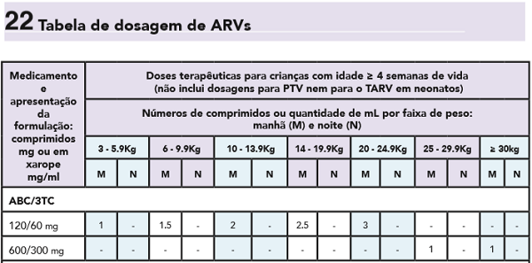

# Doseador de Antirretrovirais

O **Doseador de Antirretrovirais (DARV)** é um serviço online gratuito que, de acordo com o peso inserido pelo usuário, doseia automaticamente antirretrovirais para crianças e adolescentes em cuidados e tratamento. Tem como referência o políptico pediátrico [Manejo de infecção por HIV na criança e adolescente, versão 2022](sources/poliptico-pediatrico-16-2-2022.pdf) que, até a altura da última actualização do TARV (Setembro/2024), ainda estava em vigor no Serviço Nacional de Saúde (SNS) em Moçambique.

Trecho da Tabela de Dosagem de Arvs do políptico pediátrico Manejo de infecção por HIV na criança e adolescente, versão 2022 - Referência do DARV.

O DARV está basicamente estruturado da seguinte forma:

* Um campo com o rótulo **Peso**, para inserir o peso em quilograma(s) da criança para a qual você pretende calcular a dose;

* **ARV**, campo de seleção com todos os ARVs da Tabela de Dosagem de ARVs do políptico pediátrico. Clique no campo para abrir a lista dos ARVs e em seguida, selecione o ARV do qual pretende calcular a dose.

* **Dose, Posologia e Quantidade**: secção de saída em que são mostradas automaticamente a dose, posologia e quantidade de comprimidos a dispensar do antirretroviral (ARV) selecionado de acordo com o peso inserido;

* **Notas e Precauções**: secção de saída em que são mostradas recomendações, interações medicamentosas, entre outras informações pertinentes acerca do ARV selecionado.

## Apresentação da dose

Normalmente a dose é apresentada numa mini-tabela com quatro (4) linhas e 8 colunas.

* A 1ª linha possui duas células com os títulos **Dose-manhã** e **Dose-noite** respectivamente.

* Na 2ª linha, na primeira célula (da esquerda), é mostrada a dose do ARV que deve ser tomada ou administrada de manhã e na segunda, a dose nocturna.

* Na 4ª linha, a primeira célula mostra o número exacto de comprimidos a fornecer ao paciente para 30 dias (Dispensa mensal) e a segunda célula, para 90 dias (Dispensa trimestral).

* As duas células da 3ª linha são títulos da 4ª linha, **Dispensa mensal** e **Dispensa trimestral** respectivamente.

Por exemplo, utilizando o Doseador de ARVs para o cálculo da dose para uma criança com peso de 16 kg em uso de ABC/3TC 120 mg/60 mg, teríamos o seguinte resultado:

|Dose-manhã|Dose-noite|
|:--:|:--:|
|2.5 cp(s)| - |
|Dispensa mensal|Dispensa trimestral|
|75 cp(s)|225 cp(s)|

**Interpretação**: Neste caso significa que diariamente o paciente deve tomar 2.5 comprimidos apenas de manhã e devem ser fornecidos ao paciente 75 comprimidos (em caso de dispensa mensal) ou 225 comprimidos (se dispensa trimestral).
